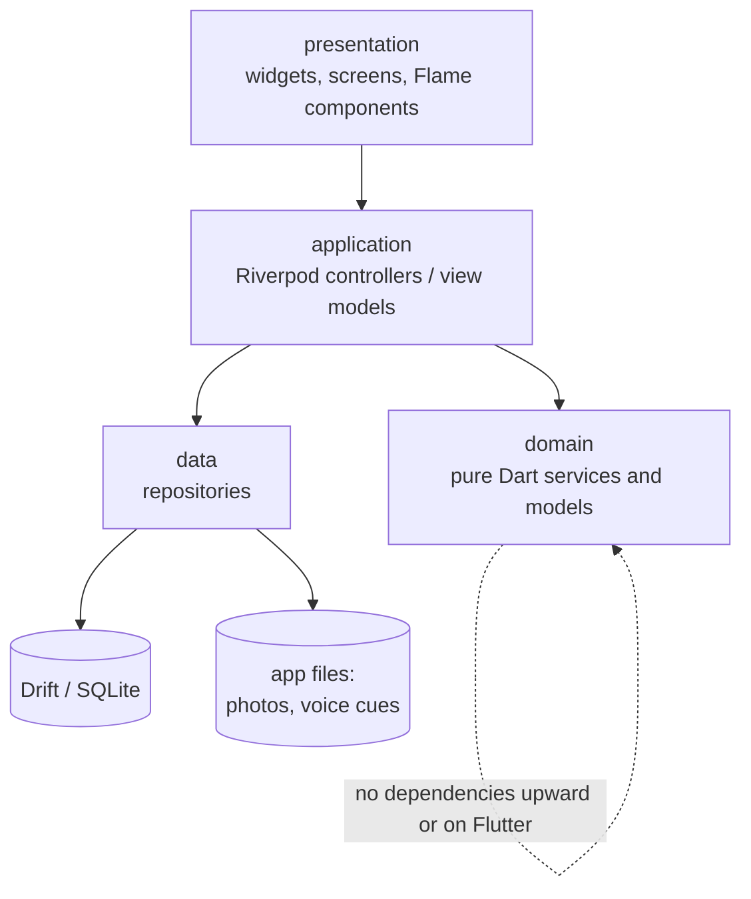
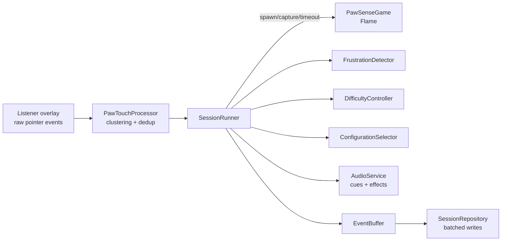
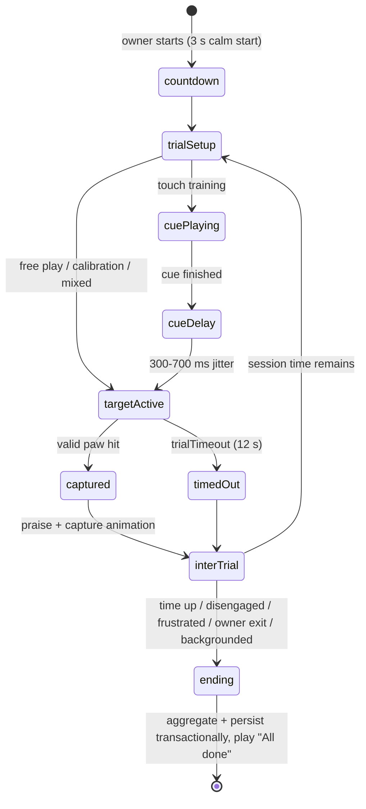

# PawSense Architecture

## Layers and dependency direction



Rules:

- `domain` (personalisation, movement, touch processing, scheduling,
  aggregation) is pure Dart: no Flutter, no Flame, no Drift imports. It is
  the tested core.
- `data` implements repositories over Drift tables and the app-managed file
  tree; exposes typed domain models, never Drift rows, to callers.
- `application` is Riverpod: providers wire repositories + services;
  Notifiers hold screen state; the `SessionRunner` orchestrates live play.
- `presentation` renders state and forwards intents. Flame components are
  presentation: they draw prey and animate; they do not decide anything.

## Source layout (feature-first)

```
lib/
  app/            MaterialApp, router, theme, config
  core/           audio, database, errors, export, files, lifecycle,
                  logging, permissions, random, time, utils
  features/
    onboarding/ cat_profiles/ profile_picker/ calibration/
    play/ (incl. game/ with components, movement, input, effects)
    training/ voice_cues/ personalisation/ session_results/
    insights/ data_management/ settings/ safety/ developer_tools/
  l10n/           ARB + generated localisations
  shared/         models (enums, trial configuration), providers, widgets
```

## The play stack



One Flutter `Listener` above the `GameWidget` captures every pointer-down/up
with pointer ids. The processor clusters near-simultaneous contacts into
logical paw interactions (180 ms / 4% of shortest dimension), classifies them
against the active target (hit / miss / edge / post-capture / owner gesture /
ignored duplicate), and hands results to the `SessionRunner` — the single
authority for trial lifecycle. Flame components only render and animate.

### Session lifecycle



Ends are typed (`SessionStatus`): completed, ownerStopped, disengaged,
frustrated, backgrounded, interrupted. Sessions start persisted as
`inProgress`; on launch, stale `inProgress` rows are finalised as
`interrupted` from their persisted trials (crash recovery).

### Event flow and persistence

- Raw pointer-downs are processed synchronously in memory (bounded queues).
- `TouchEvents` and the current `TargetTrial` are flushed to Drift at trial
  boundaries; nothing writes to the database inside the frame loop.
- At session end (any cause), one transaction: finalise session row, write
  remaining events, update `PreferenceStats` (decayed counts + EWMA), update
  `CueProgress`, bump profile difficulty.

## Personalisation (summary)

Factor-level utilities (catch/reaction/calm/timeout scores with documented
weights) + UCB exploration bonus; 80/20 exploit/explore selection under hard
safety constraints; difficulty 0-10 with evidence-gated steps and cooldown;
frustration and disengagement detectors run live. Full formulas:
[PERSONALISATION.md](PERSONALISATION.md). Every session and trial stores
`algorithmVersion` (`pawsense-personalisation-v1`) and the session seed.

## Determinism

All randomness flows through `SeededRandom` (SplitMix64). A session seed
forks per-concern child streams (schedule, movement paths, jitter), so unit,
simulation, and replay tests are exactly reproducible on every platform.

## Audio

One engine (`audioplayers`): `AudioPool` for short low-latency effects
(capture pop, prey voices, attention chirp — all synthesised originals) and a
player for owner-recorded cue files (m4a under the profile directory).
Players and pools are owned by an `AudioService` with explicit `dispose()`;
the service is a Riverpod provider scoped to app lifetime, cue players to
session lifetime.

## Files

```
<app documents>/
  pawsense.sqlite            Drift database
  profiles/<catId>/photo.jpg
  profiles/<catId>/cues/<cueType>.m4a
  export/ (transient, cleared after sharing)
```

Deleting a profile removes its directory recursively and cascades its rows.

## Error handling

Repositories return typed results or throw domain errors caught at the
controller boundary; controllers surface l10n'd error states. The play
screen fails safe: any unrecoverable game error ends the session as
`interrupted` (data preserved) and returns to the owner UI. A debug-only
`NoNetworkHttpOverrides` throws on any HTTP client creation, making an
accidental network dependency loud in development, and a unit test bans
networking packages from the pubspec.
