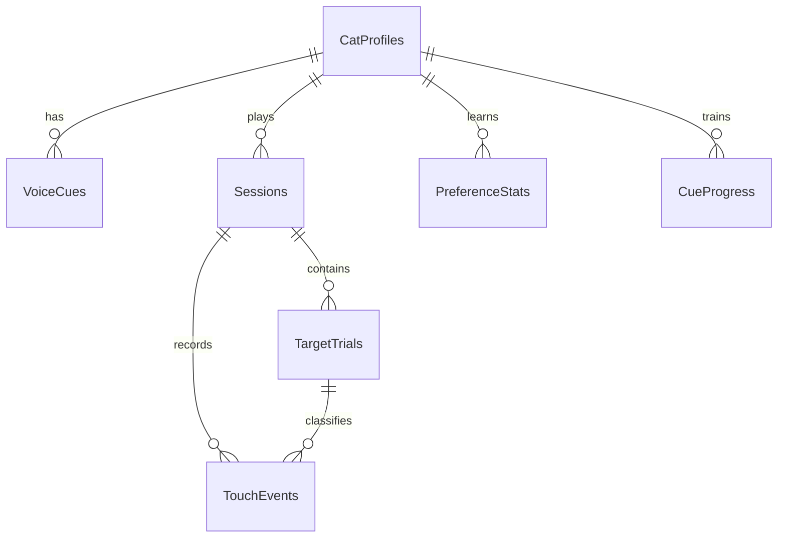

# PawSense Database Schema

Drift (SQLite), schema version 1. Source of truth:
`lib/core/database/tables/tables.dart`. Generated code is committed.

Conventions:

- Primary keys are UUIDv4 strings generated in repositories.
- Enums persist by name (`textEnum`). Renaming or reordering persisted enum
  values is a breaking change and requires a migration.
- All timestamps are UTC, stored as ISO-8601 text with millisecond
  precision (`store_date_time_values_as_text`, see build.yaml). Repositories
  only write values from `Clock.nowUtc()`.
- `PRAGMA foreign_keys = ON` is set in `beforeOpen`; deletes cascade.

## Tables

### CatProfiles

One row per cat. Questionnaire enums: ageGroup, bodySize, energyLevel,
screenExperience, favouritePrey (nullable), soundSensitivity,
treatMotivation, mobilityConsideration, visionConsideration,
hearingConsideration, primaryGoal. Plus: photoPath (relative to app
documents), notes, onboardingVersion, calibrationState, currentDifficulty
(0-10, live value maintained by the difficulty controller), algorithmVersion,
sortOrder (picker ordering; added beyond the original spec — DECISIONS.md
D-008), createdAtUtc/updatedAtUtc/archivedAtUtc.

Archiving is a soft state (archivedAtUtc set); deletion is a hard cascade
plus removal of the profile's media directory.

### VoiceCues

id, catId (FK cascade), cueType (catName | touch | good | goodJob |
allDone), filePath (relative), durationMs, timestamps.
Unique (catId, cueType): one recording per slot.

### Sessions

id, catId (nullable — null = mixed session; FK cascade), mode, startedAtUtc,
endedAtUtc, plannedDurationSeconds, actualDurationMs, status (inProgress |
completed | ownerStopped | disengaged | frustrated | backgrounded |
interrupted), calibrationSession, randomSeed (SplitMix64 seed; replays the
whole schedule), algorithmVersion, appVersion, platform,
screenWidthLogical/screenHeightLogical, ownerSubjectiveFeedback (nullable —
the owner's note, deliberately separate from observed data), aggregate
columns (catches, misses, timeouts, medianReactionMs, frustrationCount),
timestamps.

Sessions are inserted as `inProgress` before play and finalised
transactionally. Rows still `inProgress` at app launch are crash-recovered
to `interrupted` (aggregates recomputed from persisted trials; preference
models deliberately not updated from recovered sessions).

### TargetTrials

id, sessionId (FK cascade), trialIndex, the six configuration factors
(targetType, movementStyle, speedLevel, sizeLevel, soundMode, spawnZone),
spawnedAtUtc, becameTouchableAtUtc (spawn animation end; reaction time
anchors here), endedAtUtc, spawnX/YNormalised (0-1 of screen width/height),
targetPathSeed (deterministic movement replay), success,
firstSuccessfulTouchAtUtc, reactionTimeMs, missCount, timeout, cueType,
praiseCueType, rewardReminderShown, frustrationSeverity (0-3),
frustrationFlags (comma-separated stable encoding of the flag set),
trialReward (transparent reward, docs/PERSONALISATION.md), algorithmVersion.

A trial is "learning-valid" iff success or timeout — trials cut short by a
session ending do not update preference models (docs/EVENT_SCHEMA.md).

### TouchEvents

id, sessionId (FK cascade), trialId (nullable FK cascade — null when no
trial was active), pointerId, logicalInteractionId (clustering group),
occurredAtUtc, x/yNormalised, classification (hit | miss | edge |
postCapture | ownerGesture | ignoredDuplicate), deduplicated,
distanceFromTarget (shortest-dimension units; null without an active
target), createdAtUtc.

Only pointer-down derived events are stored (never pointer moves).

### PreferenceStats

id, catId (FK cascade), factorType, factorValue, then real-valued working
counters: impressions, successes, timeouts, totalMisses, frustrationCount
(real because they decay by 0.995 per update — DECISIONS.md D-005; raw
history stays in TargetTrials), reactionTimeEwmaMs, cumulativeReward,
lastUsedAtUtc, updatedAtUtc, algorithmVersion.

Unique (catId, factorType, factorValue, algorithmVersion). Median reaction
is derived from raw trials, not stored (spec allowed either).

### CueProgress

id, catId (FK cascade), cueType, exposures, successfulResponses,
reactionTimeEwmaMs, lastUsedAtUtc, updatedAtUtc.
Unique (catId, cueType).

### AppSettings

Single row (id = 1), seeded at database creation:
defaultSessionDurationSeconds (180), soundEnabled (true), rewardSchedule
(none), maxRewardReminders (3), ownerPinHash + ownerPinSalt (SHA-256(salt +
pin); a paw gate, not a security boundary), onboardingComplete,
privacyVersionAccepted, preferredLocale, reduceMotion, highContrastMode.

## Relationships

Mixed sessions have `catId = NULL`, so they survive any profile deletion and
never join to a cat.

## Migrations

`lib/core/database/migrations.dart` holds the strategy: `onCreate` builds
everything and seeds the settings row; `onUpgrade` is an explicit stepwise
`if (from < n)` ladder (schema v1 = baseline); `beforeOpen` enables foreign
keys. Every schema change bumps `currentSchemaVersion` and adds a step plus
a migration test.

## Retention and deletion

- Delete one session: removes the session row; trials and touch events
  cascade. Preference stats are NOT rolled back (the model is a running
  summary; raw history shrinks but learned state persists) — stated in the
  deletion confirmation copy.
- Delete one cat's history: all sessions for that cat (cascades as above).
- Delete a profile: the profile row (everything cascades: sessions, trials,
  events, stats, cue progress, voice cue rows) plus the media directory
  `profiles/<catId>/` on disk.
- Delete all data: every table cleared and all media removed; settings reset.

Nothing is retained anywhere else — there is no cloud, no analytics, and no
log shipping (docs/PRIVACY.md).
