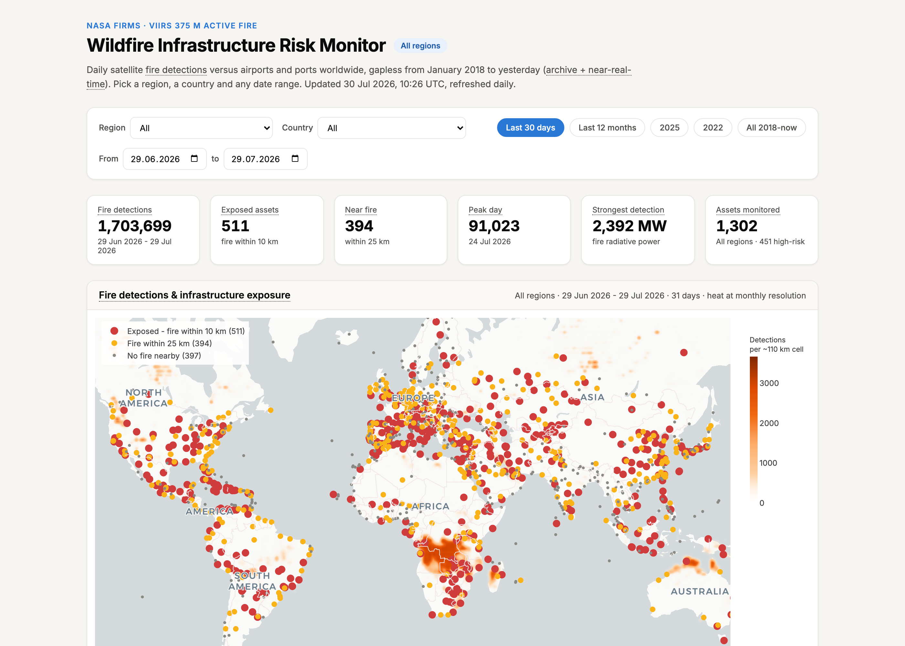

# Wildfire Infrastructure Risk Monitor

> **Summary:** Critical transport infrastructure has no systematic early view of wildfire exposure: operators typically learn of nearby fires from the news, hours to days after a satellite has already seen them. This project reduces 153 million NASA FIRMS/VIIRS active-fire detections (2018 to present, gapless to yesterday) into a percentile-based chronic-exposure risk index over 1,302 airports and ports worldwide, served as a fully client-interactive dashboard that rebuilds itself daily on GitHub Actions with zero hosting infrastructure.

[Interactive Dashboard](https://apham2509.github.io/personal-projects/wildfire-infrastructure-risk/) | [Automated Daily Pipeline](https://github.com/apham2509/personal-projects/actions/workflows/update-dashboard.yml)

---

## Output Preview & Key Metrics



- **153,160,339** vegetation-fire detections processed (2018-01-01 to present; 165M raw rows, 2.8 GB) and reduced **140:1** to a 20 MB client payload with day-accurate exposure metrics.
- **1,302 assets monitored** (1,172 large airports worldwide + 130 commercial ports); **414 airports (35%)** classify as high chronic-exposure risk over the 8.5-year record; in a typical peak-season 30-day window, **~500 assets** have active fire within 10 km.
- **End-to-end latency:** detections appear on the dashboard within ~3 hours of satellite overpass (NRT feed) via a daily automated rebuild; any date-range/region/country query recomputes client-side in under 100 ms across ~800k aggregated cells.

---

## Problem Statement & Context

**Background & Motivation.** Wildfires disrupt transport networks: airport closures, port terminal evacuations, road and rail outages. The underlying observation data exists - NASA's VIIRS instruments detect active fire at 375 m resolution, twice daily, globally - but it arrives as tens of thousands of raw thermal-anomaly points per day with no notion of *what is at risk*. The operational failure mode this project addresses is the gap between "a satellite saw fire" and "a decision-maker knows which assets are affected, how intensely, and whether this is chronic or exceptional."

**Target Stakeholders.** Network and logistics operations teams (which nodes face disruption this week), risk engineers and business-continuity planners (which assets need mitigation investment, based on 8+ years of history), and insurers/analysts pricing location-specific wildfire exposure.

**Baseline Limitations.** Naive approaches fail in specific ways:

- *News- or report-based monitoring* lags satellite observation by hours to days and has uneven geographic coverage.
- *Raw-feed alerting* ("any detection within X km") is dominated by false positives: persistent industrial heat sources (steelworks, refineries, flares) look identical to fires in a single observation. In validation, the port of Gijon showed 180 apparent exposure days that were entirely the neighbouring steelworks.
- *Snapshot views* cannot distinguish an asset's single bad week from chronic seasonal exposure - the quantity that should drive infrastructure investment.
- *Serving the raw data* is infeasible in a browser: 60k+ detections/day globally, ~20M rows/year.

---

## Mathematical Framing & Methodological Design

### 1. Mathematical Formulation

**Data.** Each detection $i$ is a tuple $(\mathbf{x}_i, t_i, p_i, \tau_i)$: location (lat/lon), acquisition date, fire radiative power $p_i$ (MW), and detection type $\tau_i$. The archive keeps only presumed vegetation fires, $\tau_i = 0$, which removes static industrial heat sources.

**Distance.** Asset-to-detection distance uses the haversine great-circle metric with Earth radius $R = 6371$ km:

$$d(\mathbf{a}, \mathbf{x}) = 2R \arcsin \sqrt{\sin^2\tfrac{\Delta\phi}{2} + \cos\phi_a \cos\phi_x \sin^2\tfrac{\Delta\lambda}{2}}$$

**Exposure.** For asset $a$, radius $r \in \{10, 25\}$ km and day $t$, the exposure set is $E_a^r(t) = \{\, i : d(\mathbf{a}, \mathbf{x}_i) \le r,\ t_i = t \,\}$. From it, per selected date window $W$:

$$N_a^r = \sum_{t \in W} |E_a^r(t)|, \qquad F_a = \sum_{t \in W} \sum_{i \in E_a^{10}(t)} p_i, \qquad D_a = |\{\, t \in W : E_a^{10}(t) \neq \emptyset \,\}|, \qquad d_a^{\min} = \min_{i} d(\mathbf{a}, \mathbf{x}_i)$$

i.e. detection counts, cumulative FRP within 10 km, distinct exposure days, and nearest-approach distance. An asset is *exposed* in $W$ if $D_a > 0$ and *near fire* if only the 25 km set is non-empty.

**Risk index.** Over the full record, each asset receives a chronic-exposure score built from empirical CDFs (percentile ranks $\hat{F}$) across the asset population:

$$R_a = 0.5\,\hat{F}_D(D_a) + 0.35\,\hat{F}_F(F_a) + 0.15\,\pi(d_a^{\min}), \qquad \pi(d) = \begin{cases} 1.0 & d < 5 \text{ km} \\ 0.6 & 5 \le d < 10 \\ 0.3 & 10 \le d < 25 \\ 0 & \text{otherwise} \end{cases}$$

with classification $R_a \ge 0.70 \Rightarrow$ high, $R_a \ge 0.40 \Rightarrow$ medium, else low, and an explicit override $R_a = 0$ when $D_a = F_a = 0$ (tied percentile ranks would otherwise assign zero-exposure assets the tie-block's average rank). Weights encode the design position that *chronic* exposure (days) matters more than cumulative intensity, which matters more than a one-off close approach.

**Spatial reduction.** The heatmap quantizes detections to grid cells $g(\mathbf{x}) = (\lfloor \phi/\delta \rceil, \lfloor \lambda/\delta \rceil)$ with $\delta = 1°$ per calendar month at world scale (0.05° per day for regional studies), storing counts per (cell, period). Exposure metrics are never quantized - they are computed from exact distances and stored per (asset, day) - so KPIs and the asset table stay day-accurate while the map trades resolution for shippability.

**Incident clustering.** Detections are observations, not fires: one persistent fire is re-observed twice daily. Near-asset detections are therefore grouped into distinct incidents as connected components over $0.05°$ cells (8-neighbourhood) split wherever consecutive activity is more than 3 days apart - so the dashboard can state "330 detections from 2 distinct incidents" and report per-incident duration, peak FRP, closest approach and approach/recede direction.

**Operational severity.** Alongside the chronic score, each asset carries a rule-based current-severity tier (High/Elevated/Watch) built from five explainable inputs: recency of the last detection within 10 km, its distance, latest-day FRP, consecutive active days, and activity relative to the asset's own seasonal norm. The acute-versus-chronic quadrant view plots this against the chronic percentile, separating "act now" from "plan long-term" without a single opaque score.

### 2. System Architecture & Pipeline Logic

```
NASA FIRMS area API ->  download_fires.py      per-year csv.gz archive (2.8 GB, local only)
OurAirports + OSM   ->  download_infrastructure.py   assets.csv per scope
                        risk_analysis.py       exposure metrics + risk baseline (regional)
                        prepare_world.py        world aggregates: monthly 1-degree cells,
                                                per-geographic-region daily series,
                                                per-asset exposure days, risk baseline
                        prepare_history.py      regional daily aggregates (feeds ports)
                        render_static.py        stitches near-real-time feed (archive end -> yesterday),
                                                emits index.html + data_world.json (20 MB)
GitHub Actions (05:30 UTC daily) -> GitHub Pages   static, CDN-served, zero infrastructure
```

Key mechanisms:

- **Ingestion** works in 5-day windows (the API maximum), with quota-aware retry: world-scale responses cost ~200 of the 5,000-per-10-min transaction budget each, so the client blocks and resumes rather than failing. Transient network errors retry with backoff. Chunks are date-disjoint by construction and deduplicated defensively, and each daily build re-derives the NRT window from scratch, so reruns are idempotent.
- **Gapless record.** The calibrated standard-processing archive ends where the near-real-time feed begins (currently 2026-04-27/28); the renderer verifies the boundary against the API's availability endpoint at every build.
- **Asset exposure at scale** uses a sorted-latitude window search: detections are sorted by latitude once, each asset reads its $\pm 0.3°$ band via binary search, filters longitude, and only then computes exact haversine distances - $O(\log n + k)$ per asset instead of $O(n)$, which keeps 1,302 assets x 20M rows/year tractable on a laptop.
- **Client-side analytics.** All interactivity (region -> cascading country filter, arbitrary from-to date ranges, sorting) is plain JavaScript over precomputed integer arrays; there is no query backend to operate, secure, or pay for.

**Method Rationale.** Percentile-rank scoring was chosen over a supervised disruption model because no labeled outcome data (closures, delays) is joined yet - an unsupervised, population-relative index is honest about that, fully explainable to non-technical stakeholders, and robust to the heavy right skew of fire-exposure distributions (a Zambian airport with 1,000 exposure days would destroy any linear scale). Bounding-box region attribution was chosen over point-in-polygon tests as an $O(1)$ operation with a bounded, documented approximation error, appropriate because regional fire totals are contextual, while asset-level results use exact country codes and exact distances. Static pre-aggregation was chosen over a server because the data changes exactly once per day - a 20 MB versioned artifact on a CDN beats a database for this access pattern.

### 3. Theoretical & Literature Grounding

1. Schroeder, W., Oliva, P., Giglio, L., Csiszar, I. (2014). *The New VIIRS 375 m active fire detection data product: Algorithm description and initial assessment.* Remote Sensing of Environment 143, 85-96. - The detection product this system consumes, including its performance characteristics and known false-positive classes.
2. Wooster, M. J., Roberts, G., Perry, G. L. W., Kaufman, Y. J. (2005). *Retrieval of biomass combustion rates and totals from fire radiative power observations.* Journal of Geophysical Research 110, D24311. - Establishes FRP as a physically grounded proxy for fire intensity and combustion rate, justifying its use as the intensity term in the risk index.
3. Giglio, L., Schroeder, W., Justice, C. O. (2016). *The Collection 6 MODIS active fire detection algorithm and fire products.* Remote Sensing of Environment 178, 31-41. - The type-classification lineage (vegetation fire vs. static land source vs. offshore) on which the industrial-source filter relies.

---

## Experimental Results & Performance Analysis

**Correctness validation.** Core math is verified against known ground truth: haversine distances within 0.2% on reference city pairs, including antimeridian crossings; day-index round-trips; streak detection; cell aggregation; and an end-to-end toy scenario through the scoring pipeline. Serialization is guarded by a strict browser-grade JSON parse at build time (`allow_nan=False` plus a Node `JSON.parse` check) after a production incident in which two Namibian airports - ISO code `NA`, silently parsed as NaN by pandas - shipped invalid JSON.

**Face validity of rankings.** The Iberian regional study ranks Reus Airport and the Port of Tarragona highest, consistent with the documented 2022 Catalonia fire season; Seville, the Huelva/Algeciras port cluster and northern-Portugal airfields follow, matching the 2022 and record 2025 Iberian seasons (49k regional detections in 2025 vs. a 10-24k normal range). Global seasonality reproduces the expected pattern, dominated by the twin African burning seasons.

**Industrial false-positive audit.** The type-0 filter removed 5,635 static-source detections from the 2022 Iberian data alone; without it, the port of Gijon ranked as the most exposed asset in Iberia (180 phantom exposure days from the adjacent steelworks). This is the single most consequential data-quality decision in the pipeline. Known residual: the NRT feed carries no type classification, so the most recent weeks can include industrial sources; they age out as the archive catches up.

**Performance.** One-off world archive download: ~5.5 h (quota-bound, resumable per year). Full aggregation of 153M rows: ~10-35 min (I/O-cache dependent). Daily CI rebuild: 15-20 min, dominated by the ~3-month world NRT pull. Client: initial 20 MB payload (~4-5 MB gzip over the wire), then <100 ms per interaction over 800k cell-months and 1,302 exposure series.

**Trade-offs and edge cases surfaced.**

- World heatmap resolution is monthly x ~110 km (day-accurate KPIs/table compensate); regional studies keep daily x ~5 km.
- Bounding-box region attribution bleeds at land borders (e.g. northern Mexico into Northern America); asset-level figures are unaffected.
- Cloud cover hides fire from the sensor: absence of detections is not evidence of absence (per Schroeder et al. 2014).
- A mid-July 2026 SNPP data gap is visible in the daily series - the pipeline reflects source outages honestly rather than interpolating.

---

## Product & Strategic Recommendations

**Operational Action Items.**

1. **Integrate the high-risk tier into continuity planning.** 414 airports worldwide sit in the high chronic-exposure class; their operators (and dependent logistics networks) should hold explicit wildfire playbooks and review them before their region's burning season, using the per-asset seasonality visible in the dashboard.
2. **Use the daily exposed-asset list as an alerting trigger.** An asset entering "exposed" status (fire within 10 km) is a concrete, low-noise signal for same-day operational review - roughly 500 assets in a peak-season month, a reviewable volume.
3. **Expand port coverage region by region.** Ports are currently Iberia-only (OSM cannot answer world-scale port queries); Mediterranean and Southeast Asian ports are the highest-value next additions given fire climatology and shipping density.

**Production Deployment Considerations.** The system deliberately has no runtime infrastructure - static artifacts on GitHub Pages behind a CDN - so "deployment" reduces to the daily build. What requires monitoring: the NASA feed itself (the availability endpoint is checked every build; source outages and the SP/NRT boundary move), API quota consumption (world NRT pulls use ~75% of one 10-minute window), and payload growth (20 MB scales linearly with archive length; per-region sharding or a binary columnar format are the prepared mitigations). The FIRMS map key is a free, rate-limited credential; rotation is a one-line change.

**Quantifiable ROI / Impact.** Replaces manual multi-source fire monitoring with a single daily artifact (estimated hours per week per operations analyst, at zero marginal hosting cost); brings disruption awareness from news-cycle latency (hours-days) to satellite latency (~3 h); and converts 8.5 years of open science data into an asset-ranked capital-allocation input that previously required a commercial risk-data subscription.

---

## Repository Structure & Quickstart

```
wildfire-infrastructure-risk/
  firms.py                    NASA FIRMS API client (quota-aware, retrying)
  regions.py                  named study regions (bounding boxes + country filters)
  world_regions.py            geographic divisions: country->region map + attribution boxes
  download_fires.py           archive ingestion, per year, resumable
  download_infrastructure.py  airports (OurAirports) + ports (OSM Overpass)
  risk_analysis.py            exposure metrics + risk scoring (regional studies)
  prepare_history.py          regional daily aggregates -> results/history_<region>.json
  prepare_world.py            world aggregates + baseline -> results/history_world.json
  render_static.py            NRT stitch + dashboard build -> site/
  bin/                        retired code kept for reference (original local Dash app)
  results/                    committed aggregates and risk baselines (CI inputs)
  data/infrastructure/        committed asset lists
  data/fires/                 raw archives - local only, gitignored (world: 2.8 GB)
  map_key.txt                 FIRMS API key (free; get yours at firms.modaps.eosdis.nasa.gov/api/map_key)
```

```bash
git clone https://github.com/apham2509/personal-projects.git
cd personal-projects/wildfire-infrastructure-risk
python3 -m venv .venv && .venv/bin/pip install -r requirements.txt

# Rebuild the dashboard from the committed aggregates (pulls ~3 months of NRT data, ~5 min)
.venv/bin/python render_static.py
open site/index.html  # serve the site/ folder for the data fetch: python3 -m http.server -d site

# Full reproduction from raw data (world archive: ~5.5 h download, quota-bound)
.venv/bin/python download_fires.py --region world --start 2018 --end 2026
.venv/bin/python download_infrastructure.py --region world
.venv/bin/python prepare_world.py

# Or a fast regional study (any bbox or named region, ~25 min end to end)
.venv/bin/python download_fires.py --region iberia
.venv/bin/python download_infrastructure.py --region iberia
.venv/bin/python risk_analysis.py --region iberia
.venv/bin/python prepare_history.py --region iberia
```

Data: NASA FIRMS (VIIRS 375 m active fire, LANCE/ESDIS), OurAirports (public domain), OpenStreetMap contributors (ODbL). The dashboard refreshes daily at 05:30 UTC via GitHub Actions.
